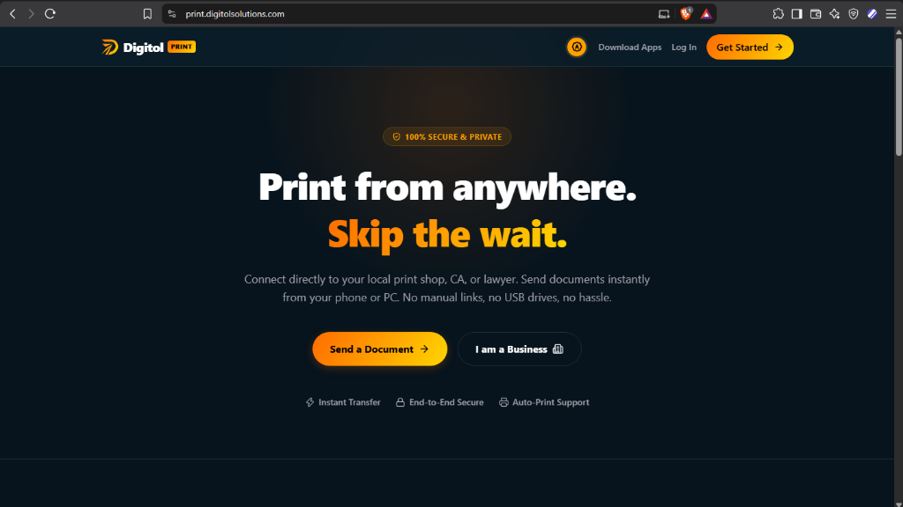
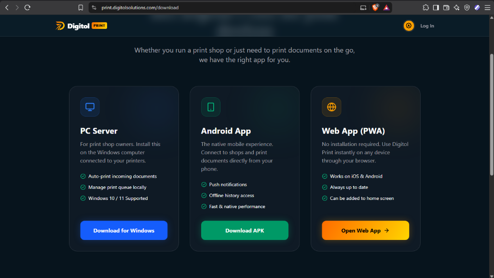
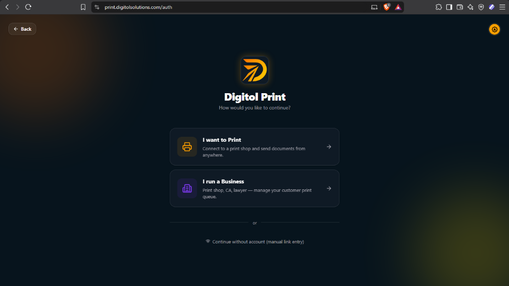

# Digitol Print

  

  <strong>Fast, Private, Direct-to-Shop Document Printing</strong> 
  A product by <a href="https://www.digitolsolutions.com/"><strong>Digitol Solutions</strong></a>

  
  
  

---

  

## 🌐 Official Links

| Destination | URL | Purpose |
|---|---|---|
| 🏢 **Digitol Solutions (Parent)** | [digitolsolutions.com](https://www.digitolsolutions.com/) | Company profile, services, and digital solutions |
| 🖨️ **Digitol Print Portal** | [print.digitolsolutions.com](https://print.digitolsolutions.com/) | Launch the web app & send print jobs online |
| 📥 **Online Download Center** | [print.digitolsolutions.com/download](https://print.digitolsolutions.com/download) | Official multi-platform download page |
| 🔐 **Account & Business Gateway** | [print.digitolsolutions.com/auth](https://print.digitolsolutions.com/auth) | Customer login and Shop Owner Business Portal |
| 📖 **About Digitol Print** | [print.digitolsolutions.com/about](https://print.digitolsolutions.com/about) | Mission, architecture, and company vision |

---

## ⬇️ Direct Application Downloads

  

| Platform | Target Audience | Direct Download Link | Size |
|---|---|---|---|
| 🤖 **Android Mobile** | **Customers** (Send documents from phone) | [📥 **Download DigitolPrint.apk**](https://github.com/playwithexoder/digitol-print-releases/releases/latest/download/DigitolPrint.apk) | ~69.6 MB |
| 🪟 **Windows 10 / 11** | **Print Shops & Businesses** (Receive & print jobs) | [📥 **Download DigitolPrint-Setup.exe**](https://github.com/playwithexoder/digitol-print-releases/releases/latest/download/DigitolPrint-Setup.exe) | ~305 MB |
| 🌐 **Web App (PWA)** | **Everyone** (No installation needed) | [🚀 **Open Web App**](https://print.digitolsolutions.com/) | 0 MB (Instant) |

All releases and historical versions: [GitHub Releases Archive](https://github.com/playwithexoder/digitol-print-releases/releases)

---

## 📲 Installing on Android
1. Download [**`DigitolPrint.apk`**](https://github.com/playwithexoder/digitol-print-releases/releases/latest/download/DigitolPrint.apk) on your Android device.
2. Open the downloaded APK. If prompted, enable **"Install unknown apps"** for your browser.
3. Tap **Install** and launch Digitol Print.

## 💻 Installing on Windows (Print Shops)
1. Download [**`DigitolPrint-Setup.exe`**](https://github.com/playwithexoder/digitol-print-releases/releases/latest/download/DigitolPrint-Setup.exe).
2. Double-click the installer. If Windows SmartScreen appears, click **More info → Run anyway**.
3. Follow the setup wizard (no administrator access required).
4. Launch the application, log in with your Business Account, and connect your printers.

---

## 🔐 Zero-Cloud Storage & Privacy Guarantee

  

- **End-to-End Direct Transfer:** Documents travel directly from the customer's device to the print shop's local computer via an encrypted point-to-point tunnel.
- **Zero Cloud Footprint:** Your private PDFs, legal documents, IDs, and contracts are **never stored on third-party cloud buckets**.
- **Instant Local Deletion:** Once printed, files are discarded according to shop retention policy.

---

  Developed with ❤️ by <a href="https://www.digitolsolutions.com/"><strong>Digitol Solutions</strong></a> 
  <em>Empowering modern businesses with digital workflow automation.</em>

